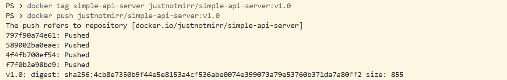
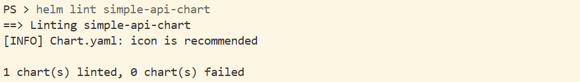
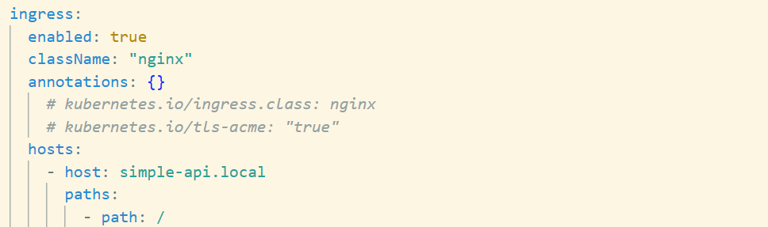

# Simple API Deployment

This document covers an end-to-end deployment pipeline for a containerized Go application. The process involves building a simple HTTP API server, packaging it into a Docker image, publishing it to Docker Hub, deploying it to a Kubernetes cluster using Helm, and exposing it via an NGINX Ingress controller.

---

## Table of Contents

1. [Create the API Server](#1-create-the-api-server)
2. [Containerize and Push to Docker Hub](#2-containerize-and-push-to-docker-hub)
3. [Deploy to Kubernetes with Helm](#3-deploy-to-kubernetes-with-helm)
4. [Configure Ingress for Domain Access](#4-configure-ingress-for-domain-access)

---

## 1. Create the API Server

Create a file named `main.go` with the following content:

```go
package main

import (
    "fmt"
    "log"
    "net/http"
)

func homePage(w http.ResponseWriter, r *http.Request) {
    fmt.Fprint(w, "Basic API Server")
}

func handleRequests() {
    fmt.Println("Starting on 8080")
    http.HandleFunc("/", homePage)
    log.Fatal(http.ListenAndServe(":8080", nil))
}

func main() {
    handleRequests()
}
```

**Code breakdown:**

- `net/http` is the Go standard library used for building HTTP clients and servers.
- `http.ResponseWriter` (`w`) is used to construct and send the HTTP response back to the client.
- `http.Request` (`r`) represents the incoming request and contains all associated data.
- `http.HandleFunc()` registers the root path `/` and maps it to the `homePage` handler function.
- `http.ListenAndServe(":8080", nil)` starts the server on port 8080. Passing `nil` uses the default request multiplexer.
- `log.Fatal()` logs any fatal error encountered during server startup and halts execution.

Initialize the Go module and run the server locally:

```bash
go mod init api/server
go run main.go
```

Verify the response with:

```bash
curl http://localhost:8080
```

Expected output:

```
Basic API Server
```

---

## 2. Containerize and Push to Docker Hub

A multi-stage Dockerfile is used to keep the final image small. The first stage compiles the Go source into a standalone binary, and the second stage copies only that binary into a minimal Alpine Linux image.

Create a `Dockerfile` in the project root:

```dockerfile
FROM golang:1.21.0 AS builder
WORKDIR /app
COPY go.mod .
RUN go mod download
COPY . .
RUN CGO_ENABLED=0 GOOS=linux GOARCH=amd64 go build -o main .

FROM alpine:latest
WORKDIR /root
COPY --from=builder /app/main .
EXPOSE 8080
CMD ["./main"]
```

**Notes:**

- `CGO_ENABLED=0` disables CGO, which is the tool that allows Go to interface with C, C++, and Fortran libraries. Disabling it produces a fully static binary that does not depend on system libraries, which is necessary for the minimal Alpine runtime image.
- `GOOS` and `GOARCH` set the target operating system and CPU architecture for the build.

Build the image and run a container from it:

```bash
docker build -t simple-api-server .
docker run -p 8080:8080 simple-api-server
```

Verify the container is working:

```bash
curl http://localhost:8080
```

Once verified, log in to Docker Hub, tag the image, and push it:

```bash
docker login
docker tag simple-api-server <your-dockerhub-username>/simple-api-server:v1.0
docker push <your-dockerhub-username>/simple-api-server:v1.0
```

Expected Output:


---

## 3. Deploy to Kubernetes with Helm

Helm is used to generate a templated chart for the application. The `values.yaml` file serves as the central configuration, specifying the Docker Hub image, tag, and container port.

Create and validate the chart:

```bash
helm create simple-api-chart
helm lint simple-api-chart
```

Expected Output:



Update `values.yaml` to point to your Docker Hub image and set the container port to `8080`.

Connect to the Kubernetes cluster and install the chart:

```bash
kubectl get nodes
helm install simple-api ./simple-api-chart
kubectl get pods
```

Use port-forwarding to verify the deployment locally:

```bash
kubectl port-forward svc/simple-api-chart-service 8080:8080
```

Then run `curl http://localhost:8080` to confirm the server is responding.

---

## 4. Configure Ingress for Domain Access

An NGINX Ingress controller is installed to handle external traffic routing. The Helm chart is then updated to create an Ingress resource that maps the custom domain `simple-api.local` to the service.

**Install the NGINX Ingress Controller:**

```bash
kubectl apply -f https://raw.githubusercontent.com/kubernetes/ingress-nginx/controller-v1.10.0/deploy/static/provider/cloud/deploy.yaml
```

**Update `values.yaml`** to enable the Ingress resource and set the host to `simple-api.local`.



**Apply the updated chart:**

```bash
helm upgrade simple-api ./simple-api-chart
```

**Edit the hosts file** to map the domain to localhost. On Windows, open `C:\Windows\System32\drivers\etc\hosts` as an administrator and add the following line:

```
127.0.0.1 simple-api.local
```

Navigate to `http://simple-api.local` in a browser to confirm the deployment is accessible via the custom domain.

## Final Outcome
This pipeline demonstrates a deployment workflow for a containerized application. Starting from a minimal Go HTTP server, the process covers every stage from writing and testing source code locally, to compiling it into a static binary, packaging it into a lightweight Docker image, and publishing that image to Docker Hub as a versioned artifact.

On the infrastructure side, Helm provides a clean, templated approach to managing Kubernetes resources, making the deployment repeatable and straightforward to update. The addition of an NGINX Ingress controller completes the setup by enabling domain-based routing, which reflects how traffic is typically handled in real cluster environments.

#### At the end of this assignment:

1. A Go API server is built.
2. The application is containerized using Docker.
3. The image is pushed to Docker Hub.
4. The application is deployed to Kubernetes using Helm.
5. Ingress is configured for domain-based access.