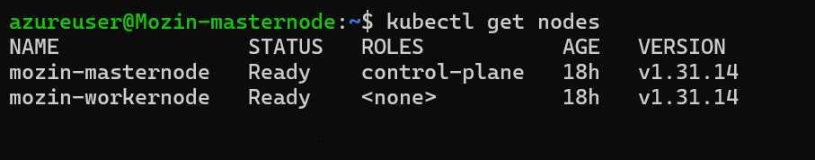
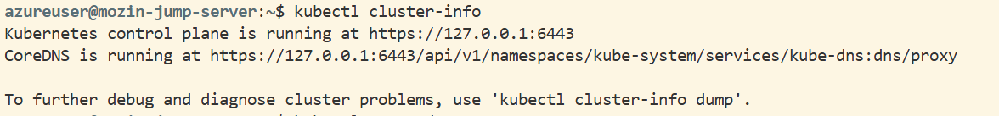
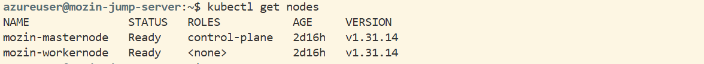
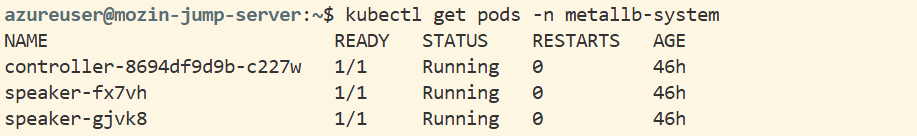
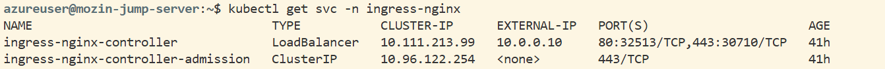
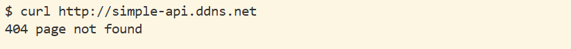
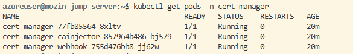
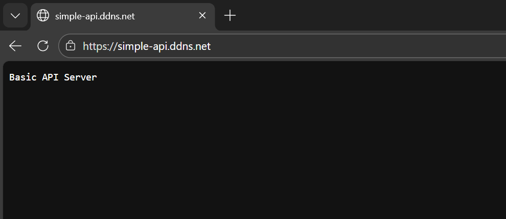

# Kubernetes Cluster Deployment Project

## Project Overview

This project involves the deployment and configuration of a production-grade Kubernetes cluster on private virtual machines with secure remote access and load balancing capabilities.

The project establishes a secure, scalable Kubernetes environment suitable for hosting containerized applications with enterprise-level access control and service delivery mechanisms.

## Architecture Overview

### Infrastructure Components

The infrastructure consists of three virtual machines organized in the following configuration:

1. Jump Server: A publicly accessible virtual machine that serves as the entry point for cluster management and administration.

2. Control Plane Node (Private VM): The master node responsible for managing the cluster state, scheduling workloads, and maintaining cluster health. This node runs the Kubernetes API server, controller manager, and etcd database.

3. Worker Node (Private VM): A compute node that executes application workloads in the form of containerized pods.

### Service Interactions and Data Flow

The architecture implements a layered access pattern:

- External administrator connects to the Jump Server via SSH
- The Jump Server establishes an SSH tunnel to the Control Plane node
- kubectl commands route through the SSH tunnel to reach the Kubernetes API server
- MetalLB handles service load balancing using IPs from the private network range
- Container runtime (containerd) on both nodes manages pod execution

### Network Architecture

The deployment uses the following network configuration:

- Private network CIDR: 10.0.0.0/24
- Pod network CIDR: 10.244.0.0/16 (managed by Flannel)
- MetalLB IP pool: 10.0.0.10 - 10.0.0.20
- Control Plane advertise address: 10.0.0.5
- Jump Server: Public IP with access to private network

## Tasks Documentation

### Task 1: Deploy Kubernetes Using kubeadm

#### Objective

Establish a production-grade two-node Kubernetes cluster on private virtual machines using kubeadm, enabling container orchestration with proper resource management and networking.

#### Prerequisites

- Two private virtual machines with Ubuntu operating system
- Minimum 2 CPU cores and 2GB RAM per node
- SSH access to both nodes
- Internet connectivity for package downloads
- sudo privileges on both nodes

#### Configuration Steps for All Nodes

The following configuration applies to both the Control Plane and Worker nodes.

##### Disable Swap

Kubernetes requires swap to be disabled to ensure predictable performance and proper resource reservation. Run the following commands:

```bash
sudo swapoff -a
sudo sed -i '/ swap / s/^/#/' /etc/fstab
```

The first command disables swap immediately, and the second command prevents swap from re-enabling after system reboot by commenting out swap entries in the filesystem configuration.

##### Load Kernel Modules

Enable the overlay filesystem for container image storage and netfilter for bridged networking:

```bash
cat <<EOF | sudo tee /etc/modules-load.d/k8s.conf
overlay
br_netfilter
EOF

sudo modprobe overlay
sudo modprobe br_netfilter
```

The overlay module provides the storage driver for container images, while br_netfilter enables kernel-level packet filtering for bridged network traffic.

##### Configure Networking Bridge and Forwarding

Configure kernel parameters to allow iptables to inspect bridged traffic and enable IP forwarding:

```bash
cat <<EOF | sudo tee /etc/sysctl.d/k8s.conf
net.bridge.bridge-nf-call-iptables  = 1
net.bridge.bridge-nf-call-ip6tables = 1
net.ipv4.ip_forward                 = 1
EOF

sudo sysctl --system
```

These settings enable the kernel to route pod traffic between nodes and allow network policies to function correctly.

##### Install Security Dependencies and Docker GPG Key

Install tools for handling HTTPS repositories and add Docker's GPG key:

```bash
sudo apt-get update
sudo apt-get -y install ca-certificates gnupg

sudo install -m 0755 -d /etc/apt/keyrings/
sudo curl -fsSL https://download.docker.com/linux/ubuntu/gpg | sudo gpg --dearmor -o /etc/apt/keyrings/docker.gpg
sudo chmod a+r /etc/apt/keyrings/docker.gpg
```

This ensures secure package downloads and verifies the authenticity of Docker packages before installation.

##### Add Docker Repository

Add the Docker repository to system package sources:

```bash
echo \
  "deb [arch=$(dpkg --print-architecture) signed-by=/etc/apt/keyrings/docker.gpg] https://download.docker.com/linux/ubuntu \
  $(. /etc/os-release && echo "$VERSION_CODENAME") stable" | \
  sudo tee /etc/apt/sources.list.d/docker.list > /dev/null

sudo apt-get update
```

This provides access to the latest Docker packages for your Ubuntu version.

##### Install and Configure containerd

Install the containerd container runtime and configure SystemdCgroup:

```bash
sudo apt-get install -y containerd.io

containerd config default | sudo tee /etc/containerd/config.toml >/dev/null 2>&1
sudo sed -i 's/SystemdCgroup \= false/SystemdCgroup \= true/g' /etc/containerd/config.toml

sudo systemctl restart containerd
sudo systemctl enable containerd
```

SystemdCgroup aligns container resource management with the Linux operating system's cgroup v2 implementation, ensuring proper resource isolation and limits.

##### Add Kubernetes Repository

Configure the official Kubernetes v1.31 repository:

```bash
sudo apt-get update
sudo apt-get install -y apt-transport-https ca-certificates curl gpg

curl -fsSL https://pkgs.k8s.io/core:/stable:/v1.31/deb/Release.key | sudo gpg --dearmor -o /etc/apt/keyrings/kubernetes-apt-keyring.gpg

echo 'deb [signed-by=/etc/apt/keyrings/kubernetes-apt-keyring.gpg] https://pkgs.k8s.io/core:/stable:/v1.31/deb/ /' | sudo tee /etc/apt/sources.list.d/kubernetes.list

sudo apt-get update
```

This adds the official Kubernetes repository with GPG signature verification.

##### Install Kubernetes Components

Install kubelet, kubeadm, and kubectl, then prevent automatic updates:

```bash
sudo apt-get install -y kubelet kubeadm kubectl
sudo apt-mark hold kubelet kubeadm kubectl
sudo apt-get install -y conntrack
```

- kubelet: Node agent that runs on each node and manages pods
- kubeadm: Tool for initializing and joining cluster nodes
- kubectl: Command-line interface for cluster management
- conntrack: Utility required by kubelet for connection tracking

#### Control Plane Node Setup

The following steps apply only to the primary node that will serve as the control plane.

##### Initialize Kubernetes Cluster

Initialize the cluster with the control plane's internal IP and pod network configuration:

```bash
sudo kubeadm init --apiserver-advertise-address=10.0.0.5 --pod-network-cidr=10.244.0.0/16
```

The apiserver-advertise-address specifies the IP that other nodes will use to communicate with the API server, and pod-network-cidr defines the network range for pod-to-pod communication.

The output of this command includes a kubeadm join command with a token and discovery hash. Save this output as it is required to add worker nodes to the cluster.

##### Configure kubeconfig for Local Access

Copy the cluster admin configuration to the user's home directory:

```bash
mkdir -p $HOME/.kube
sudo cp -i /etc/kubernetes/admin.conf $HOME/.kube/config
sudo chown $(id -u):$(id -g) $HOME/.kube/config
```

This configuration file contains the credentials and API server address needed for kubectl to communicate with the cluster.

##### Install Pod Network Plugin (Flannel)

Deploy Flannel as the pod network plugin to enable communication between pods across different nodes:

```bash
kubectl apply -f https://github.com/flannel-io/flannel/releases/latest/download/kube-flannel.yml
```

Flannel creates an overlay network using VXLAN encapsulation, allowing pods on different nodes to communicate as if on the same network segment.

#### Worker Node Setup

The following steps apply only to the node that will serve as a worker node.

##### Join Cluster

Use the token and discovery hash from the control plane initialization to add the worker node:

```bash
kubeadm join 10.0.0.5:6443 --token txeh8h.yonbtchxxo3ch3nd \
        --discovery-token-ca-cert-hash sha256:b900af4db17ecaeefaa6a2d230d2e5cc97dbe1ca19fb3cf66d5fcece945a8600
```

Replace the token and discovery hash with the values from your control plane initialization output. This command registers the worker node with the cluster and installs necessary components.

#### Verification

Verify cluster deployment by checking node status on the control plane:

```bash
kubectl get nodes
```

Expected output showing both nodes in Ready state:



Both nodes should display a STATUS of Ready, indicating successful cluster initialization and node registration.

---

### Task 2: Configure Jump Server Access

#### Objective

Establish secure remote access to the private Kubernetes cluster from the Jump Server using SSH tunneling, allowing cluster management without direct network exposure.

#### Prerequisites

- Kubernetes cluster deployed and operational (from Task 1)
- Jump Server with public IP and SSH access
- SSH key-based authentication configured
- Network connectivity between Jump Server and private nodes
- User account on Jump Server with sudo privileges

#### Installation of kubectl on Jump Server

Install the Kubernetes command-line tool to the Jump Server:

```bash
curl -LO "https://dl.k8s.io/release/$(curl -L -s https://dl.k8s.io/release/stable.txt)/bin/linux/amd64/kubectl"

sudo install -o root -g root -m 0755 kubectl /usr/local/bin/kubectl

kubectl version --client
```

This downloads the latest stable kubectl binary, installs it to the system path, and verifies the installation. The version command confirms that kubectl is properly installed and accessible.

#### Retrieve kubeconfig File

Copy the cluster administration configuration from the control plane node to the Jump Server:

```bash
mkdir -p ~/.kube

scp azureuser@10.0.0.5:~/.kube/config ~/.kube/config

chmod 600 ~/.kube/config
```

The kubeconfig file contains the API server address, client certificates, and authentication tokens required for kubectl to access the cluster. The directory and file permissions ensure proper security.

Replace azureuser with your actual username on the control plane node. The IP address 10.0.0.5 should match your control plane's private IP.

#### Establish SSH Tunnel

Create a persistent background SSH tunnel from the Jump Server to the control plane:

```bash
ssh -fNT -L 6443:localhost:6443 azureuser@10.0.0.5
```

This command establishes a secure tunnel with the following behavior:

- -f: Runs SSH in background
- -N: Does not execute remote commands
- -T: Disables pseudo-terminal allocation
- -L 6443:localhost:6443: Binds port 6443 on the Jump Server and forwards traffic through SSH to port 6443 on the control plane

All kubectl traffic to localhost:6443 on the Jump Server will route through this encrypted SSH connection to the Kubernetes API server.

#### Configure Local Routing

Update the kubeconfig file to use the local tunnel endpoint:

```bash
sed -i 's/<CONTROL_PLANE_IP>/127.0.0.1/g' ~/.kube/config
```

This replaces the control plane's private IP address with 127.0.0.1 (localhost), directing kubectl to use the SSH tunnel instead of attempting direct network access.

#### Bypass TLS Certificate Mismatch

The Kubernetes API server's TLS certificate is signed for the private IP address (10.0.0.5), but kubectl connects via localhost (127.0.0.1). Configure kubectl to expect the correct certificate:

```bash
kubectl config set-cluster kubernetes --tls-server-name=10.0.0.5
```

This instructs kubectl to validate the TLS certificate against the control plane's private IP, even though the actual connection uses localhost. This prevents certificate validation errors while maintaining security.

#### Verification of Jump Server Access

Test connectivity from the Jump Server to the cluster:

```bash
kubectl cluster-info
kubectl get nodes
```

Expected output for ```cluster-info```:



Expected output for ```get nodes```:



Both commands should execute successfully, confirming that the SSH tunnel and kubeconfig are properly configured.

---

### Task 3: Configure MetalLB with Public IP

#### Objective

Deploy MetalLB load balancer to provide LoadBalancer-type services for applications in the cluster, assigning addresses from the private network range.

#### Prerequisites

- Fully functional two-node Kubernetes cluster
- Jump Server with kubectl access configured
- Private network IP range allocated for load balancer addresses (10.0.0.10 - 10.0.0.20)
- kubectl access from Jump Server

#### Install MetalLB

Deploy the MetalLB controller and speaker components:

```bash
kubectl apply -f https://raw.githubusercontent.com/metallb/metallb/v0.14.8/config/manifests/metallb-native.yaml
```

This manifest deploys two key components:

- Controller: Manages IP address assignments to LoadBalancer services
- Speaker: DaemonSet that announces service IPs using Layer 2 protocols

Verify MetalLB components are running:

```bash
kubectl get pods -n metallb-system
```

Expected Output:



All pods in the metallb-system namespace should display a STATUS of Running. This confirms that both the controller and speaker pods are operational before proceeding with configuration.

#### Create IPAddressPool

Define the range of IP addresses that MetalLB can assign to LoadBalancer services. Create a file named ipaddresspool.yaml:

```yaml
apiVersion: metallb.io/v1beta1
kind: IPAddressPool
metadata:
  name: private-pool
  namespace: metallb-system
spec:
  addresses:
  - 10.0.0.10-10.0.0.20
```

This configuration allocates addresses from 10.0.0.10 through 10.0.0.20 to MetalLB. These addresses should be within your private network range and not conflict with existing VM or infrastructure addresses.

Apply the IPAddressPool:

```bash
kubectl apply -f ipaddresspool.yaml
```

The pool will be created in the metallb-system namespace, allowing the controller to reference it when assigning IPs.

#### Configure L2Advertisement

Create a Layer 2 advertisement to announce the allocated addresses on the network. Create a file named l2advertisement.yaml:

```yaml
apiVersion: metallb.io/v1beta1
kind: L2Advertisement
metadata:
  name: l2-adv
  namespace: metallb-system
spec:
  ipAddressPools:
  - private-pool
```

This configuration tells the MetalLB speaker pods to announce the addresses from the private-pool using ARP (Address Resolution Protocol) on Layer 2 of the network stack.

Apply the L2Advertisement:

```bash
kubectl apply -f l2advertisement.yaml
```

Once applied, the speaker pods will begin announcing the allocated IP addresses to the network.

#### Verification and Testing

Create a test deployment and service to verify MetalLB functionality:

```bash
kubectl create deployment nginx-test --image=nginx
kubectl expose deployment nginx-test --port=80 --type=LoadBalancer
```

This creates an nginx deployment and exposes it as a LoadBalancer service. The service should be assigned an external IP from the MetalLB pool.

Verify external IP allocation:

```bash
kubectl get svc nginx-test
```

Expected output:

```
NAME         TYPE           CLUSTER-IP    EXTERNAL-IP   PORT(S)        AGE
nginx-test   LoadBalancer   10.96.1.100   10.0.0.10     80:30123/TCP   10s
```

The EXTERNAL-IP column should show an address from the configured pool (10.0.0.10 - 10.0.0.20). If the external IP shows as pending, verify that the speaker pods are running and properly announcing the addresses.

---

### Task 4: Deploy Application with Ingress

#### Objective

Deploy the containerized Go API to the Kubernetes cluster using Helm, configure domain-based routing through an NGINX Ingress Controller, and bridge public internet traffic to the private cluster through the Jump Server.

#### Prerequisites

- Fully functional Kubernetes cluster with MetalLB configured (Tasks 1-3)
- Helm chart for the simple-api application built locally
- kubectl access from Jump Server
- A No-IP account for dynamic DNS

#### Transfer the Helm Chart

If the Helm chart was built on a local machine, it must first be transferred to the Jump Server to deploy it into the private cluster.

Compress the Helm chart and transfer it using scp. Run this on your local machine:

```bash
tar -czvf simple-api-chart.tar.gz ./simple-api-chart
scp ./simple-api-chart.tar.gz azureuser@20.244.15.70:~/
```

Extract the archive on the Jump Server:

```bash
tar -xzvf ~/simple-api-chart.tar.gz
```

#### Deploy the Application

Use Helm to deploy the simple-api into the cluster. This creates the application pods and the internal ClusterIP service.

```bash
helm install simple-api ./simple-api-chart/
kubectl get pods
kubectl get svc
```

Verify that the `simple-api-simple-api-chart` service is running and its endpoint is registered on port 8080:

```bash
kubectl describe svc simple-api-simple-api-chart
kubectl get endpoints simple-api-simple-api-chart
```

Expected output:

```
NAME                          ENDPOINTS          AGE
simple-api-simple-api-chart   10.244.1.10:8080   1m
```

#### Install NGINX Ingress Controller

Because MetalLB is running, it will automatically assign the Ingress Controller a private IP from the address pool.

Install through Helm:

```bash
helm repo add ingress-nginx https://kubernetes.github.io/ingress-nginx
helm repo update
helm install ingress-nginx ingress-nginx/ingress-nginx \
  --namespace=ingress-nginx --create-namespace
```

Verify the NGINX Ingress Controller service:

```bash
kubectl get svc -n ingress-nginx
```

Wait until the `EXTERNAL-IP` changes from `<pending>` to the MetalLB-assigned IP (e.g., `10.0.0.10`) before proceeding.

Expected output:



Note the NodePort assigned for port 80 (e.g., `32513`). This will be needed later.

#### Configure DNS (No-IP)

Configure public DNS to point to the Jump Server. The Jump Server is used here because public DNS cannot route directly to the private MetalLB IP (`10.0.0.10`). The Jump Server acts as the public gateway into the private network.

1. Go to [https://my.noip.com/](https://my.noip.com/) and create a hostname (e.g., `simple-api.ddns.net`).
2. Set the IPv4 Address (A Record) to the Jump Server's Public IP.

#### Create the Ingress Resource

Apply the routing rules that tell the NGINX Ingress Controller to forward traffic for the domain to the simple-api service. Create a file named `ingress.yaml`:

```yaml
apiVersion: networking.k8s.io/v1
kind: Ingress
metadata:
  name: simple-api-ingress
spec:
  ingressClassName: nginx
  rules:
  - host: "simple-api.ddns.net"
    http:
      paths:
      - path: /
        pathType: Prefix
        backend:
          service:
            name: simple-api-simple-api-chart
            port:
              number: 8080
```

Apply the manifest:

```bash
kubectl apply -f ingress.yaml
```

Verify the Ingress was created and has an address assigned:

```bash
kubectl get ingress
kubectl describe ingress simple-api-ingress
```

Expected output:

```
NAME                 CLASS   HOSTS                 ADDRESS     PORTS   AGE
simple-api-ingress   nginx   simple-api.ddns.net   10.0.0.10   80      1m
```

#### Bridge Public Traffic to the Private Cluster

The intended traffic flow was:

```
Internet → Jump Server Public IP:80 → iptables DNAT → MetalLB IP (10.0.0.10):80 → NGINX Ingress Controller → ClusterIP Service → Pod
```

Enable IP forwarding on the Jump Server and configure iptables to forward public traffic toward the MetalLB IP:

```bash
sudo sysctl -w net.ipv4.ip_forward=1
sudo iptables -t nat -A PREROUTING -i eth0 -p tcp --dport 80 -j DNAT --to-destination 10.0.0.10:80
sudo iptables -t nat -A POSTROUTING -j MASQUERADE
```

#### Issue Encountered: MetalLB L2 Mode is Incompatible with Azure VNet

After completing all the steps above, every external request returned `404 page not found`. Port-forwarding worked correctly, confirming the pod and service were healthy. The NGINX Ingress Controller logs showed no new entries when requests were made, meaning traffic was never reaching the ingress pod at all.



##### Diagnosis

The debugging process systematically eliminated each layer of the stack:

**1. Verified the application layer was healthy.** Port-forwarding worked, the pod returned `Basic API Server`, endpoints were registered, and `pathType` was correctly set to `Prefix`. The problem was not in the application or Kubernetes configuration.

**2. Verified DNS was correct.** `nslookup simple-api.ddns.net` resolved correctly to the Jump Server's public IP. DNS was not the issue.

**3. Verified the iptables DNAT rule was firing.** The packet counter on the PREROUTING rule incremented with each request, confirming traffic was arriving at the Jump Server and being forwarded toward `10.0.0.10:80`.

**4. Verified NGINX was not receiving the traffic.** Running `kubectl logs -f` on the ingress pod while making requests showed no new log entries. The 404 was not coming from NGINX.

**5. Ran tcpdump on the worker node.** While curling `10.0.0.10`, a `tcpdump -i any port 80` on the worker node showed zero packets arriving for that IP. Traffic forwarded to `10.0.0.10` was disappearing between the Jump Server and the worker node.

**6. Inspected the ARP table on the Jump Server.** This revealed the root cause:

```
10.0.0.1     ether   12:34:56:78:9a:bc   C   eth0
10.0.0.5     ether   12:34:56:78:9a:bc   C   eth0
10.0.0.6     ether   12:34:56:78:9a:bc   C   eth0
10.0.0.7     ether   12:34:56:78:9a:bc   C   eth0
10.0.0.10    ether   12:34:56:78:9a:bc   C   eth0
```

Every IP in the subnet resolved to the same synthetic MAC address `12:34:56:78:9a:bc`.

##### Root Cause

Azure Virtual Networks do not use real Layer 2 networking. Azure's SDN (Software Defined Networking) layer operates at Layer 3 and intercepts all ARP traffic at the hypervisor level, returning a synthetic MAC address for every IP regardless of what is actually on the network. VMs cannot send gratuitous ARP announcements that the network will honor.

MetalLB in L2 mode works by having its speaker pod send gratuitous ARP announcements to claim ownership of the virtual IP (`10.0.0.10`), telling the network "send traffic for this IP to my MAC address." On Azure, these announcements are silently discarded by the hypervisor. The virtual IP `10.0.0.10` therefore has no actual routing backing it, so packets destined for it are dropped.

### Task 4A: Set Up Port Forwarding For Ingress

#### Overview

Since MetalLB L2 mode is incompatible with Azure VNet, the Ingress Controller cannot receive a publicly routable IP directly. Instead, the Jump Server acts as a public entry point, forwarding traffic to the private MetalLB IP using `kubectl port-forward`.

#### Verify the Ingress Controller has a MetalLB IP

```bash
kubectl get svc -n ingress-nginx
```

Expected output - `EXTERNAL-IP` should show a private IP from your MetalLB pool (e.g., `10.0.0.10`):

```
NAME                       TYPE           CLUSTER-IP       EXTERNAL-IP   PORT(S)
ingress-nginx-controller   LoadBalancer   10.105.136.229   10.0.0.10     80:30662/TCP,443:32613/TCP
```

#### Create a Systemd Service for Persistent Port Forwarding

First, copy the kubeconfig to root's home directory so the service can authenticate:

```bash
sudo mkdir -p /root/.kube
sudo cp ~/.kube/config /root/.kube/config
```

Create the service file:

```bash
sudo nano /etc/systemd/system/k8s-portforward.service
```

Paste the following:

```ini
[Unit]
Description=Kubernetes port-forward for ingress controller (80/443)
After=network-online.target
Wants=network-online.target

[Service]
Type=simple
User=root
Environment=KUBECONFIG=/root/.kube/config
ExecStart=/usr/local/bin/kubectl port-forward svc/ingress-nginx-controller -n ingress-nginx 80:80 443:443 --address 0.0.0.0
Restart=always
RestartSec=5

[Install]
WantedBy=multi-user.target
```

Enable and start the service:

```bash
sudo systemctl daemon-reload
sudo systemctl enable k8s-portforward.service
sudo systemctl start k8s-portforward.service
```

#### Clear `iptables` DNAT Rules

If `iptables DNAT` was previously used to forward traffic, those rules will intercept traffic before it reaches port-forward, causing requests to go directly to the unreachable MetalLB IP.

Check for conflicting DNAT rules: 

```bash
sudo iptables -t nat -L PREROUTING -n -v
```

If you see a rule like this, it must be removed:

```
DNAT  tcp  --  eth0  *  0.0.0.0/0  0.0.0.0/0  tcp dpt:80 to:10.0.0.10:80
```

Remove all PREROUTING rules:

```bash
sudo iptables -t nat -F PREROUTING
```

### Verify 

```bash
sudo systemctl status k8s-portforward.service
sudo ss -tlnp | grep :80
curl http://simple-api.ddns.net
```

Expected output from the last command: `Basic API Server`.

---

### Task 5: Configure SSL with `cert-manager`

Configuring automatic TLS certificates for the Kubernetes cluster using cert-manager and Let's Encrypt. The HTTP-01 ACME challenge is used for domain validation, which works over standard HTTP port 80.

#### Install Cert-Manager

```bash
kubectl apply -f https://github.com/cert-manager/cert-manager/releases/download/v1.14.5/cert-manager.yaml
```

Wait until all cert-manager pods are `Running` before proceeding:

```bash
kubectl get pods -n cert-manager -w
```

Expected Output:



#### Create the ClusterIssuer

It tells cert-manager how to request certificates form Ler's Encrypt using the HTTP-01 challenge.

Create `clusterissuer.yaml`:

```yaml
apiVersion: cert-manager.io/v1
kind: ClusterIssuer
metadata:
  name: letsencrypt-prod
spec:
  acme:
    email: your@email.com
    server: https://acme-v02.api.letsencrypt.org/directory
    privateKeySecretRef:
      name: letsencrypt-prod-key
    solvers:
    - http01:
        ingress:
          class: nginx
```

Apply it:

```bash
kubectl apply -f clusterissuer.yaml
```

Verify it is ready:

```bash
kubectl describe clusterissuer letsencrypt-prod
```

The message should show `The ACME account was registered with the ACME server`.

#### Configure the Helm Chart `values.yaml`

The ingress must have three things for TLS to work correctly:

1. The `cert-manager.io/cluster-issuer` annotation to trigger certificate creation.
2. The `nginx.ingress.kubernetes.io/ssl-redirect: "false"` annotation to allow the HTTP-01 challenge through without being redirected to HTTPS.
3. A `tls` section referencing the secret where the certificate will be stored.

Edit `simple-api-chart/values.yaml` and update the ingress section:

```yaml
ingress:
  enabled: true
  className: "nginx"
  annotations:
    cert-manager.io/cluster-issuer: letsencrypt-prod
    nginx.ingress.kubernetes.io/ssl-redirect: "false"
  hosts:
    - host: simple-api.ddns.net
      paths:
        - path: /
          pathType: Prefix
  tls:
    - hosts:
        - simple-api.ddns.net
      secretName: simple-api-tls
```

Apply the changes:

```bash
helm upgrade simple-api ./simple-api-chart
```

#### Verify Certificate Issuance

Watch the certificate become ready:

```bash
kubectl get certificate -n default -w
```

Expected final state:

```
NAME             READY   SECRET           AGE
simple-api-tls   True    simple-api-tls   2m
```

Describe it for full details:

```bash
kubectl describe certificate simple-api-tls -n default
```

Look for:

```
Message: Certificate is up to date and has not expired
Status:  True
Type:    Ready
```

#### Verify HTTPS

```bash
curl https://simple-api.ddns.net
```

Expected output: `Basic API Server`.



---

### Task 6: Create CI/CD Pipeline with GitHub Actions

Implement an automated deployment pipeline using GitHub Actions that builds a Docker image on code push, pushes it to DockerHub, and deploys it to the Kubernetes cluster via Helm.

#### Configure GitHub Repository Secrets

Navigate to the GitHub repository, then go to Settings, Secrets and variables, Actions, and add the following secrets.

| Secret Name | Description |
| --- | --- |
| DOCKERHUB_USERNAME | DockerHub account username |
| DOCKERHUB_TOKEN | DockerHub personal access token |
| JUMP_SERVER_IP | Public IP address of the jump server |
| JUMP_SERVER_USER | SSH username for the jump server |
| JUMP_SERVER_SSH_KEY | Private SSH key used to access the jump server |

To generate a DockerHub access token, log in to hub.docker.com, go to Account Settings, then Personal Access Tokens, and create a new token with read and write permissions.

#### Create the GitHub Actions Workflow File

Create the following directory structure inside the repository:

```bash
.github/
  workflows/
    <workflow-file-name>.yml
```

Create the file at .github/workflows/deploy.yml with the required content. Example `deploy.yaml`:


```YAML
name: github-actions-cicd

on:
  push:
    branches: [main]
    paths: ['task2-files/**']
  workflow_dispatch:

jobs:
  build-and-push:
    name: build and push docker image
    runs-on: ubuntu-latest
    outputs:
      image-tag: ${{ steps.vars.outputs.sha }}

    steps:
      - name: checkout code
        uses: actions/checkout@v4

      - name: set image tag
        id: vars
        run: echo "sha=$(echo ${{ github.sha }} | cut -c1-7)" >> $GITHUB_OUTPUT

      - name: login to dockerhub
        uses: docker/login-action@v3
        with:
          username: ${{ secrets.DOCKERHUB_USERNAME }}
          password: ${{ secrets.DOCKERHUB_TOKEN }}

      - name: build and push docker image
        uses: docker/build-push-action@v5
        with:
          context: ./task1-files
          push: true
          tags: ${{ secrets.DOCKERHUB_USERNAME }}/simple-api-server:${{ steps.vars.outputs.sha }}

  deploy:
    name: deploy to kubernetes
    runs-on: ubuntu-latest
    needs: build-and-push

    steps:
      - name: checkout code
        uses: actions/checkout@v4

      - name: setup ssh agent
        uses: webfactory/ssh-agent@v0.8.0
        with:
          ssh-private-key: ${{ secrets.JUMP_SERVER_SSH_KEY }}

      - name: copy helm chart to jump server
        run: |
          scp -o StrictHostKeyChecking=no -r ./task2-files/simple-api-chart \
            ${{ secrets.JUMP_SERVER_USER }}@${{ secrets.JUMP_SERVER_IP }}:~/simple-api-chart

      - name: deploy via helm
        env:
          IMAGE_TAG: ${{ needs.build-and-push.outputs.image-tag }}
          DOCKERHUB_USERNAME: ${{ secrets.DOCKERHUB_USERNAME }}
          JUMP_USER: ${{ secrets.JUMP_SERVER_USER }}
          JUMP_HOST: ${{ secrets.JUMP_SERVER_IP }}
        run: |
          ssh -o StrictHostKeyChecking=no ${JUMP_USER}@${JUMP_HOST} "
            helm upgrade --install simple-api ~/simple-api-chart \
              --reuse-values \
              --set image.repository=${DOCKERHUB_USERNAME}/simple-api-server \
              --set image.tag=${IMAGE_TAG} \
              --set image.pullPolicy=Always \
              --namespace default \
              --timeout 10m \
              --wait
          "

      - name: verify rollout
        env:
          JUMP_USER: ${{ secrets.JUMP_SERVER_USER }}
          JUMP_HOST: ${{ secrets.JUMP_SERVER_IP }}
        run: |
          ssh -o StrictHostKeyChecking=no ${JUMP_USER}@${JUMP_HOST} \
            "kubectl rollout status deployment/simple-api-simple-api-chart -n default"
```

The workflow is triggered in two ways. First, automatically on every push to the main branch that includes changes inside the task2-files directory. Second, manually from the GitHub Actions tab using the workflow_dispatch trigger.

The pipeline is divided into two jobs:

1. build-and-deploy

This job runs on a GitHub-hosted Ubuntu runner. It checks out the repository code, generates a short 7-character Git SHA to use as the Docker image tag, logs into DockerHub using the stored secrets, builds the Docker image from the task2-files directory, and pushes the image to DockerHub. The image tag is passed as an output to the second job.

2. deploy

This job runs after the first job `build-and-deploy` completes successfully. It checks out the code, configures the SSH private key to allow access to the jump server, copies the Helm chart from the repository to the jump server using SCP, then SSHes into the jump server and runs the Helm upgrade command with the new image tag set via the --set flag. Finally, it verifies that the Kubernetes deployment rolled out successfully.

#### Push the Workflow File

```bash
git add .github/workflows/deploy.
git commit -m "add cicd pipeline with github-actions"
git push origin main
```

Since the commit does not include changes inside task2-files, the pipeline will not trigger automatically from this push. To trigger it manually, go to the GitHub repository, click the Actions tab, select the workflow named github-actions-cicd, and click Run workflow.

#### Verify the Pipeline

After the pipeline runs, verify the deployment from the jump server:

```bash
kubectl get pods -n default
kubectl get deployment simple-api-simple-api-chart -n default
```

To confirm the new image tag was applied:

```bash
kubectl describe deployment simple-api-simple-api-chart -n default | grep Image
```

The image shown should match the DockerHub image with the Git SHA tag that was built during the pipeline run.

The Kubernetes cluster nodes are on private VMs with no public IP. GitHub Actions runners are cloud-hosted and cannot reach the cluster directly. To solve this, the pipeline SSHes into the jump server, which already has kubectl and Helm configured with access to the private cluster. All Helm and kubectl commands are executed remotely on the jump server rather than on the GitHub Actions runner itself.

---

#### Troubleshooting MetalLB 

If the external IP remains pending, check speaker pod logs:

```bash
kubectl logs -n metallb-system -l app=speaker
```

Verify the IPAddressPool and L2Advertisement are properly applied:

```bash
kubectl get <ipaddresspool-name> -n metallb-system
kubectl get <l2advertisement-name> -n metallb-system
```

Both resources should display with a status indicating they are configured. If issues persist, ensure the pod network plugin (Flannel) is functioning properly by checking pod network connectivity.

---

## Common Commands Reference

### Cluster Inspection

```bash
kubectl get nodes
kubectl get pods --all-namespaces
kubectl get services --all-namespaces
kubectl get deployments --all-namespaces
kubectl cluster-info
```

### Troubleshooting

```bash
kubectl describe node <node-name>
kubectl describe pod <pod-name> -n <namespace>
kubectl logs <pod-name> -n <namespace>
kubectl get events -n <namespace>
```

### Ingress Specific

```bash
kubectl get ingress
kubectl describe ingress 
kubectl get svc -n ingress-nginx
kubectl logs -n ingress-nginx 
```

---

## Known Limitations and Considerations

1. MetalLB L2 mode is incompatible with Azure VNet. Azure's SDN layer suppresses gratuitous ARP announcements, preventing MetalLB from claiming virtual IPs. On Azure, use NodePort-based traffic forwarding as a workaround, or use the Azure Cloud Controller Manager for native LoadBalancer support.

2. The SSH tunnel is temporary and requires re-establishment if the connection drops. Consider a systemd service for persistent tunnel management.

3. Single control plane node represents a potential single point of failure. HA deployments require multiple control plane nodes with etcd clustering.

4. The IP address pool (10.0.0.10 - 10.0.0.20) is limited to 11 addresses. Expand this range if more LoadBalancer services are required.

5. Pod network CIDR (10.244.0.0/16) provides 256 subnets, sufficient for most small to medium deployments.