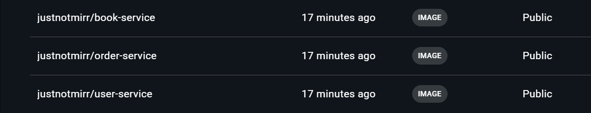
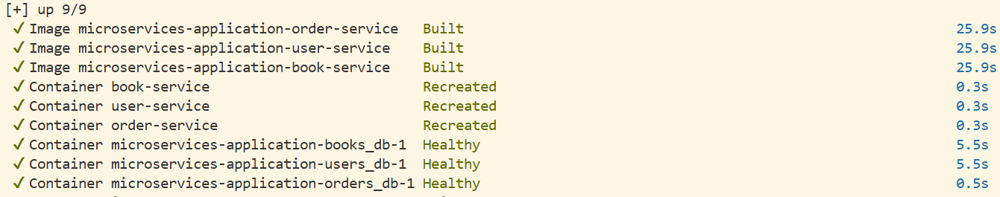
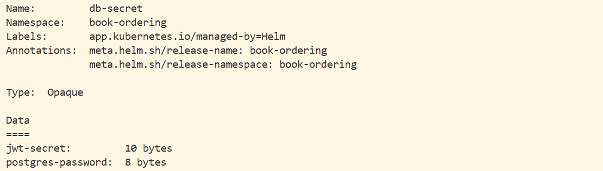
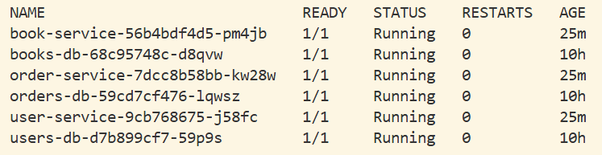
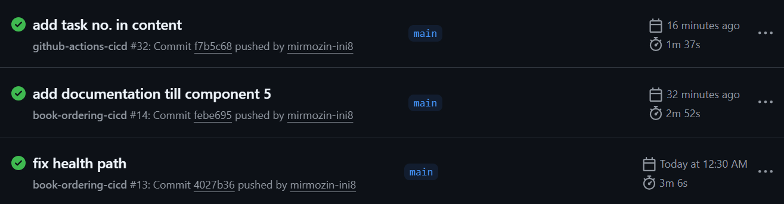
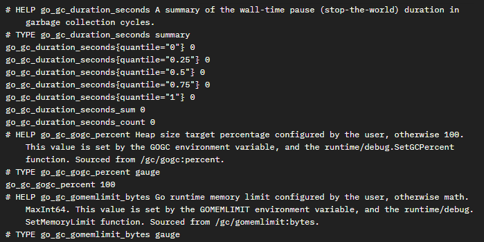
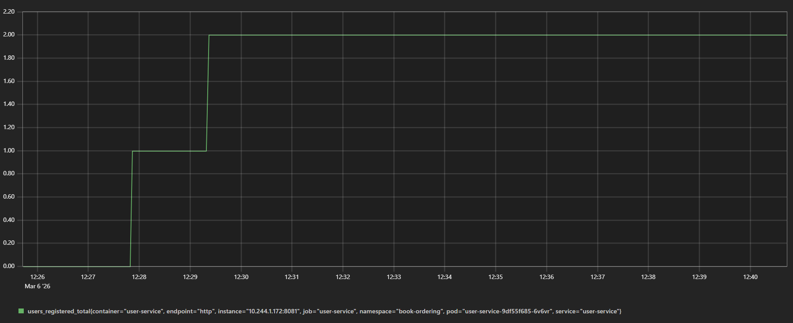
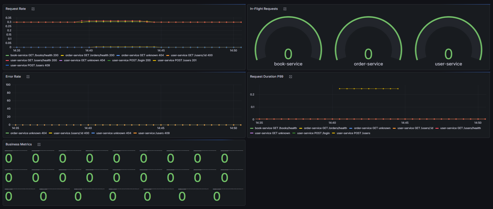
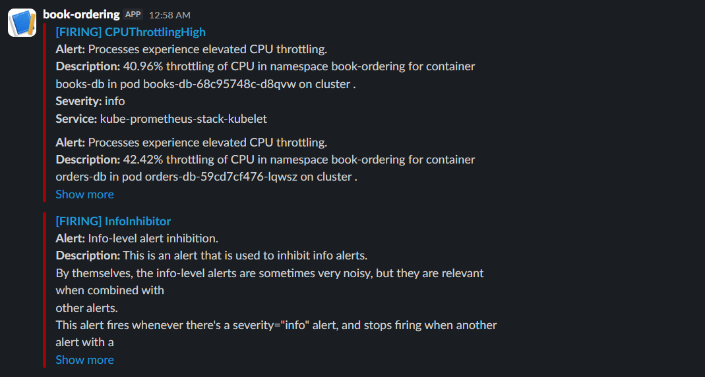

# Book Ordering System

A microservices-based book ordering application built with Go (Gin), deployed on Kubernetes using Helm. Three independent services communicate over HTTP using Kubernetes internal DNS, with all external traffic routed through an NGINX Ingress Controller.

---

## Table of Contents

- [Architecture Overview](#architecture-overview)
- [Infrastructure](#infrastructure)
- [Component 1: Microservices Development](#component-1-microservices-development)
- [Component 2: Database Configuration](#component-2-database-configuration)
- [Component 3: Containerization](#component-3-containerization)
- [Component 4: Kubernetes Deployment](#component-4-kubernetes-deployment)
- [Component 5: CI/CD Pipeline](#component-5-cicd-pipeline)
- [Component 6: Monitoring](#component-6-monitoring)
- [API Testing](#api-testing)
- [Debugging Reference](#debugging-reference)
- [Known Limitations](#known-limitations)

---

## Architecture Overview

```
Client → book-ordering.dynv6.net
       → Jump Server (public IP)
         → kubectl port-forward :8080 → ingress-nginx-controller:80
           → Ingress (path-based routing)
               /books/*   → book-service:8080
               /users/*   → user-service:8081
               /login     → user-service:8081
               /orders/*  → order-service:8082
```

### Inter-Service Communication

`order-service` calls `book-service` and `user-service` over HTTP using Kubernetes internal DNS. URLs are injected via ConfigMap:

```
BOOK_SERVICE_URL = http://book-service:8080
USER_SERVICE_URL = http://user-service:8081
```

---

## Infrastructure

| Component | Value |
|---|---|
| Master node | mozin-masternode |
| Worker node | mozin-workernode |
| Kubernetes | v1.31.14 (kubeadm) |
| CNI | Flannel |
| Ingress | NGINX (ingress-nginx) |
| Storage | rancher/local-path |
| Helm | v4.1.1 |
| Domain | book-ordering.dynv6.net |

---

## Component 1: Microservices Development

### Technology Stack

| Layer | Choice |
|---|---|
| Language | Go 1.22+ |
| Web Framework | Gin |
| Database Driver | lib/pq (PostgreSQL) |
| Authentication | golang-jwt/jwt/v5 |
| Password Hashing | golang.org/x/crypto/bcrypt |
| Env Config | joho/godotenv |
| Containerization | Docker multi-stage builds |

---

### Task 1.1: book-service

#### Objective

Create a RESTful API for book catalog management with full CRUD operations backed by a dedicated PostgreSQL database.

#### Prerequisites

- Go 1.22+ installed
- PostgreSQL instance accessible at the configured host and port
- Environment variables set for database connection and server port

#### Database Schema

The `books` table is created automatically on service startup using `CREATE TABLE IF NOT EXISTS`:

```sql
CREATE TABLE IF NOT EXISTS books (
    id         SERIAL PRIMARY KEY,
    title      TEXT NOT NULL,
    author     TEXT NOT NULL,
    price      NUMERIC(10, 2) NOT NULL,
    stock      INTEGER NOT NULL DEFAULT 0,
    created_at TIMESTAMP DEFAULT CURRENT_TIMESTAMP
);
```

#### API Endpoints

| Method | Path | Auth | Description |
|---|---|---|---|
| GET | /books/health | No | Health check |
| GET | /books/metrics | No | Metrics placeholder |
| GET | /books | No | List all books |
| GET | /books/:id | No | Get a specific book |
| POST | /books | No | Create a new book |
| PUT | /books/:id | No | Partial update |
| DELETE | /books/:id | No | Delete a book |

#### Environment Variables

```
BOOKS_DB_HOST=books-db
BOOKS_DB_PORT=5432
BOOKS_DB_USER=postgres
BOOKS_DB_PASSWORD=<from secret>
BOOKS_DB_NAME=books_db
BOOKS_SERVER_PORT=8080
```

---

### Task 1.2: user-service

#### Objective

Create a user management and authentication service that handles registration, login, and profile updates, issuing signed JWT tokens on successful login.

#### Prerequisites

- Go 1.22+ installed
- PostgreSQL instance accessible at the configured host and port
- `SECRET_KEY` environment variable set - this value must be identical to the one configured in order-service, as both services sign and validate the same JWT tokens

#### Database Schema

The `users` table is created automatically on service startup:

```sql
CREATE TABLE IF NOT EXISTS users (
    id            SERIAL PRIMARY KEY,
    username      TEXT NOT NULL UNIQUE,
    email         TEXT NOT NULL UNIQUE,
    password_hash TEXT NOT NULL,
    created_at    TIMESTAMP DEFAULT CURRENT_TIMESTAMP
);
```

`UNIQUE` constraints on `username` and `email` enforce uniqueness at the database level.

#### JWT Authentication Flow

1. Client POSTs credentials to `POST /login`
2. user-service verifies the password against the stored bcrypt hash
3. On success, signs a JWT containing `user_id` using `SECRET_KEY`
4. Client includes the token in subsequent requests: `Authorization: Bearer <token>`
5. Auth middleware validates the signature, extracts `user_id`, and sets it in the Gin context
6. Handlers read `user_id` from the context - never from the request body

> `user_id` is always taken from the validated JWT, never from the request body. This prevents users from creating or accessing resources belonging to other users.

#### API Endpoints

| Method | Path | Auth | Description |
|---|---|---|---|
| GET | /users/health | No | Health check |
| GET | /users/metrics | No | Metrics placeholder |
| POST | /users | No | Register a new user |
| GET | /users/:id | No | Get user details |
| POST | /login | No | Login - returns JWT token |
| PUT | /users/:id | Yes - Bearer JWT | Update own profile only |

#### Environment Variables

```
USERS_DB_HOST=users-db
USERS_DB_PORT=5432
USERS_DB_USER=postgres
USERS_DB_PASSWORD=<from secret>
USERS_DB_NAME=users_db
USERS_SERVER_PORT=8081
SECRET_KEY=<from secret>
```

---

### Task 1.3: order-service

#### Objective

Create an order processing service that handles order creation and retrieval by communicating with book-service and user-service over HTTP. All order endpoints require JWT authentication.

#### Prerequisites

- Go 1.22+ installed
- PostgreSQL instance accessible at the configured host and port
- book-service and user-service running and reachable at the URLs configured in environment variables
- `SECRET_KEY` set to the same value used by user-service

#### Database Schema

The `orders` table is created automatically on service startup:

```sql
CREATE TABLE IF NOT EXISTS orders (
    id          SERIAL PRIMARY KEY,
    user_id     INTEGER NOT NULL,
    book_id     INTEGER NOT NULL,
    quantity    INTEGER NOT NULL CHECK (quantity > 0),
    total_price NUMERIC(10,2) NOT NULL,
    status      TEXT NOT NULL DEFAULT 'confirmed',
    created_at  TIMESTAMP DEFAULT CURRENT_TIMESTAMP
);
```

A `CHECK` constraint enforces that quantity is always greater than zero at the database level.

#### Order Creation Flow

1. Client sends `POST /orders` with `book_id` and `quantity` - JWT required
2. Middleware validates the JWT and extracts `user_id`
3. Calls `GET /users/:userId` on user-service to verify the user exists
4. Calls `GET /books/:bookId` on book-service to verify the book and check stock
5. If `book.Stock < quantity` - returns `400` with the available stock count
6. Computes `total_price = book.Price * quantity`
7. Inserts the order with status `confirmed`

#### Route Registration Order

The static route must be registered before the dynamic route in Gin, otherwise `/user/:userId` will be matched as `/:id`:

```go
protected.GET("/user/:userId", handler.GetOrdersByUserID)
protected.GET("/:id", handler.GetOrderByID)
```

#### API Endpoints

| Method | Path | Auth | Description |
|---|---|---|---|
| GET | /orders/health | No | Health check |
| GET | /orders/metrics | No | Metrics placeholder |
| POST | /orders | Yes - Bearer JWT | Create a new order |
| GET | /orders/user/:userId | Yes - Bearer JWT | Get all orders for authenticated user |
| GET | /orders/:id | Yes - Bearer JWT | Get a specific order |

#### Environment Variables

```
ORDERS_DB_HOST=orders-db
ORDERS_DB_PORT=5432
ORDERS_DB_USER=postgres
ORDERS_DB_PASSWORD=<from secret>
ORDERS_DB_NAME=orders_db
ORDERS_SERVER_PORT=8082
BOOK_SERVICE_URL=http://book-service:8080
USER_SERVICE_URL=http://user-service:8081
SECRET_KEY=<from secret>
```

---

## Component 2: Database Configuration

### Task 2: Database Setup

#### Objective

Configure an isolated PostgreSQL database for each microservice so that each service owns its data independently with no shared database server.

#### Prerequisites

- PostgreSQL 15 available as a container image
- Kubernetes cluster with a configured StorageClass (required for PersistentVolumeClaims)
- Secrets containing database credentials created in the target namespace

#### Database Instances

Each service connects to its own PostgreSQL instance. The instances are isolated by separate pods and ClusterIP services within the cluster.

| Service | Database Name | Internal Host | Port |
|---|---|---|---|
| book-service | books_db | books-db | 5432 |
| user-service | users_db | users-db | 5432 |
| order-service | orders_db | orders-db | 5432 |

> In Docker Compose, different host ports (5432, 5433, 5434) are used to avoid conflicts on the local machine. In Kubernetes, all three databases use port 5432 - they are isolated by separate pods and ClusterIP services.

#### Schema Management

Schema creation is handled in-process at service startup via `CREATE TABLE IF NOT EXISTS` in each service's `database/db.go`. The startup is idempotent - the table is only created if it does not already exist. No external migration tool is required at this stage.

#### Connection Pooling

The standard `database/sql` package is used with the `lib/pq` driver. `database/sql` provides built-in connection pooling by default. Pool settings (max open connections, max idle connections) are left at defaults, which is appropriate for this environment.

---

## Component 3: Containerization

### Task 3.1: Create Dockerfiles

#### Objective

Containerize all three microservices using multi-stage Docker builds that produce small, secure runtime images containing only the compiled binary.

#### Prerequisites

- Docker installed on the build machine
- DockerHub account for pushing images
- Go module files (`go.mod`, `go.sum`) present in each service directory

#### Multi-Stage Build Pattern

All three services follow the same two-stage Dockerfile pattern. Stage 1 compiles the binary; Stage 2 is a minimal Alpine runtime that contains only the binary and CA certificates.

The `CGO_ENABLED=0` flag produces a fully static binary with no libc dependency, which allows it to run on a minimal Alpine image without any additional system libraries.

The following is the Dockerfile for book-service. The same pattern applies to user-service and order-service, with the binary name and exposed port adjusted accordingly.

```dockerfile
FROM golang:1.22-alpine AS builder

WORKDIR /app/
COPY go.mod go.sum ./
RUN go mod download

COPY . .
RUN CGO_ENABLED=0 GOOS=linux GOARCH=amd64 go build -o book-service .

FROM alpine:3.23.3

WORKDIR /root/
RUN apk --no-cache add ca-certificates
COPY --from=builder /app/book-service ./

RUN adduser -D appuser
USER appuser

EXPOSE 8080
CMD ["./book-service"]
```

A non-root `appuser` is created and set as the runtime user, following the principle of least privilege. The final image contains no Go toolchain or source code.

#### Build and Push

Build all three images from the local machine, tagging with a version:

```powershell
docker build -t justnotmirr/book-service:v1.3 ./book-service
docker build -t justnotmirr/user-service:v1.3 ./user-service
docker build -t justnotmirr/order-service:v1.3 ./order-service
```

Push the images to Docker Hub:

```powershell
docker push justnotmirr/book-service:v1.3
docker push justnotmirr/user-service:v1.3
docker push justnotmirr/order-service:v1.3
```

#### Verification

Confirm the images are available on Docker Hub before proceeding to deployment. Each image should be listed under the account at hub.docker.com with the correct tag.



---

### Task 3.2: Docker Compose Setup

#### Objective

Create a local development environment using Docker Compose that brings up all six containers - three databases and three application services - with proper dependency ordering and volume persistence.

#### Prerequisites

- Docker and Docker Compose v2 installed
- `.env` file present with all required environment variable values

#### Service Configuration

| Container | Host Port | Depends On |
|---|---|---|
| books_db | 5432:5432 | - |
| users_db | 5433:5432 | - |
| orders_db | 5434:5432 | - |
| book-service | 8080:8080 | books_db (healthy) |
| user-service | 8081:8081 | users_db (healthy) |
| order-service | 8082:8082 | orders_db (healthy), book-service, user-service |

Database containers are configured with a `pg_isready` health check. Application services use `condition: service_healthy` so they do not start until their respective database is ready to accept connections.

#### Running the Stack

To start all containers in detached mode:

```bash
docker compose up --build -d
```



To tear down all containers and remove volumes:

```bash
docker compose down -v
```

#### Verification

Once all containers are running, verify each service responds on its health endpoint:

```bash
curl http://localhost:8080/books/health
curl http://localhost:8081/users/health
curl http://localhost:8082/orders/health
```

Expected Output:
```bash
{
    "service": "<service-name>",
    "status": "ok"
}
```

---

## Component 4: Kubernetes Deployment

### Task 4.1: Create Kubernetes Manifests

#### Objective

Deploy all three microservices and their databases on the Kubernetes cluster using Deployment and Service manifests, packaged as a Helm chart.

#### Prerequisites

- Kubernetes cluster running with kubectl access configured
- Helm installed on the machine from which deployments will be run
- Docker images pushed to Docker Hub and accessible from cluster nodes
- A default StorageClass configured in the cluster (required for database PVCs)

#### Helm Chart Structure

All Kubernetes manifests are managed as a single Helm chart named `book-ordering`. The chart structure is as follows:

```
book-ordering/
├── Chart.yaml
├── values.yaml
└── templates/
    ├── namespace.yaml
    ├── secrets.yaml
    ├── configmap.yaml
    ├── books-db.yaml
    ├── users-db.yaml
    ├── orders-db.yaml
    ├── book-service.yaml
    ├── user-service.yaml
    ├── order-service.yaml
    └── ingress.yaml
```

Each database is deployed as a StatefulSet with a PersistentVolumeClaim. Each application service is deployed as a Deployment with a ClusterIP Service.

#### Storage Provisioner

If the cluster has no default StorageClass, all PVCs will remain in `Pending` state, which prevents databases from starting and causes application services to crash-loop. Install `rancher/local-path-provisioner` to provide a default StorageClass:

```bash
kubectl apply -f https://raw.githubusercontent.com/rancher/local-path-provisioner/master/deploy/local-path-storage.yaml
```

Set it as the cluster default:

```bash
kubectl patch storageclass local-path \
  -p '{"metadata": {"annotations":{"storageclass.kubernetes.io/is-default-class":"true"}}}'
```

Verify the StorageClass is marked as default:

```bash
kubectl get storageclass
```

Expected Output:
```bash
NAME                   PROVISIONER             RECLAIMPOLICY   VOLUMEBINDINGMODE      ALLOWVOLUMEEXPANSION   AGE
local-path (default)   rancher.io/local-path   Delete          WaitForFirstConsumer   false                  22h
```

#### Health Probes

Liveness and readiness probes are configured on all six workloads. Application services use HTTP GET probes; databases use exec probes running `pg_isready`.

| Service | Liveness Path | Readiness Path | Notes |
|---|---|---|---|
| book-service | /books/health | /books/health | HTTP GET on port 8080 |
| user-service | /users/health | /users/health | HTTP GET on port 8081 |
| order-service | /orders/health | /orders/health | HTTP GET on port 8082 |
| *-db | pg_isready -U postgres | pg_isready -U postgres | exec probe |

Health and metrics routes in order-service are registered outside the auth middleware group so that Kubernetes probes do not require a JWT token.

---

### Task 4.2: Configure ConfigMaps and Secrets

#### Objective

Externalise all configuration and credentials from application images using Kubernetes ConfigMaps for non-sensitive values and Secrets for sensitive values.

#### Prerequisites

- Helm chart structure in place with a `templates/configmap.yaml` and `templates/secrets.yaml`
- All sensitive values base64-encoded before being placed in the Secret manifest

#### ConfigMap

The ConfigMap holds non-sensitive configuration that is shared across services: internal service hostnames, database names, ports, and inter-service URLs. These values are injected as environment variables into each Deployment.

Key settings from `values.yaml` that populate the ConfigMap:

```yaml
database:
  books:
    host: books-db
    name: books_db
    user: postgres
    port: "5432"

ingress:
  host: book-ordering.dynv6.net
  className: nginx
```

#### Secrets

The `db-secret` Secret holds the PostgreSQL password and the JWT signing key. Values must be base64-encoded:

```yaml
postgres-password: cGFzc3dvcmQ=
jwt-secret: aTV1MGd5VVJKcg==
```

To generate a base64 value for any string:

```bash
echo -n 'your-value' | base64
```

Secrets are injected per service as follows:

| Service | Environment Variable | Secret Key |
|---|---|---|
| book-service | BOOKS_DB_PASSWORD | postgres-password |
| user-service | USERS_DB_PASSWORD | postgres-password |
| user-service | SECRET_KEY | jwt-secret |
| order-service | ORDERS_DB_PASSWORD | postgres-password |
| order-service | SECRET_KEY | jwt-secret |
| All databases | POSTGRES_PASSWORD | postgres-password |

#### Verification

Confirm the Secret and ConfigMap were created in the namespace:

```bash
kubectl get secret -n book-ordering
kubectl get configmap -n book-ordering
```

Both resources should be listed. To verify the Secret contains the expected keys without revealing values:

```bash
kubectl describe secret db-secret -n book-ordering
```



---

### Task 4.3: Configure Ingress

#### Objective

Set up a unified external access point for all three services using path-based routing through an NGINX Ingress Controller.

#### Prerequisites

- Helm installed with the ingress-nginx repository added
- MetalLB or equivalent load balancer configured so the Ingress Controller can obtain an external IP
- DNS record pointing the domain to the Jump Server's public IP

#### Install NGINX Ingress Controller

Add the ingress-nginx Helm repository and install the controller into its own namespace:

```bash
helm repo add ingress-nginx https://kubernetes.github.io/ingress-nginx
helm repo update

helm install ingress-nginx ingress-nginx/ingress-nginx \
  --namespace ingress-nginx \
  --create-namespace
```

Verify the controller service has been assigned an external IP before proceeding:

```bash
kubectl get svc -n ingress-nginx
```

Wait until the `EXTERNAL-IP` column shows an IP address rather than `<pending>`.

Expected Output:
```bash
NAME                                 TYPE           CLUSTER-IP       EXTERNAL-IP   PORT(S)                      AGE
ingress-nginx-controller             LoadBalancer   10.105.136.229   10.0.0.10     80:30662/TCP,443:32613/TCP   6d20h
ingress-nginx-controller-admission   ClusterIP      10.104.107.24    <none>        443/TCP                      6d20h
```

#### Ingress Routing Configuration

Path-based routing is configured in `templates/ingress.yaml` using `ImplementationSpecific` pathType with regex rewriting, and `Exact` for the login endpoint:

```yaml
/books(/|$)(.*)   → book-service:8080    (ImplementationSpecific)
/users(/|$)(.*)   → user-service:8081    (ImplementationSpecific)
/login            → user-service:8081    (Exact)
/orders(/|$)(.*)  → order-service:8082   (ImplementationSpecific)
```

Key `values.yaml` settings for the Ingress:

```yaml
ingress:
  host: book-ordering.dynv6.net
  className: nginx
```

#### Verification

After deploying the Helm chart, confirm the Ingress resource has been assigned an address:

```bash
kubectl get ingress -n book-ordering
```

The ADDRESS column should show the MetalLB-assigned IP.

---

### Task 4.4: Deploy on Kubernetes

#### Objective

Deploy the complete application stack - all services, databases, configuration, and ingress - to the Kubernetes cluster using Helm.

#### Prerequisites

- kubectl configured with access to the cluster from the Jump Server
- Helm chart present on the Jump Server
- Docker images available on Docker Hub
- StorageClass configured (see Task 4.1)
- NGINX Ingress Controller installed (see Task 4.3)

#### Step 1: Copy the Helm Chart to the Jump Server

Transfer the chart from the local machine to the Jump Server using scp:

```powershell
scp -r .\book-ordering\ azureuser@<jump-server-public-ip>:~/
```

#### Step 2: Validate the Chart

Run a lint check and a dry-run install to catch any manifest errors before applying to the cluster:

```bash
helm lint ./book-ordering/
helm install book-ordering ./book-ordering/ --dry-run=client --debug
```

Review the dry-run output to confirm all resources are rendered correctly.

#### Step 3: Deploy

Install the Helm release into the `book-ordering` namespace, creating the namespace if it does not exist:

```bash
helm install book-ordering ./book-ordering/ \
  --namespace book-ordering \
  --create-namespace
```

#### Pod Startup Behaviour

Application services will restart once or twice on the first deployment. This is expected behaviour because Kubernetes has no `depends_on` equivalent - all six pods start simultaneously, and the application services will fail their initial database connection while PostgreSQL is still initialising.

```
t=0s    All 6 pods start simultaneously
t=2s    Services attempt database connection - refused (postgres still initialising)
t=2s    Services exit (Exit Code 1)
t=30s   Databases become ready
t=31s   Kubernetes restarts services - connection succeeds
t=40s   All 6 pods Running
```

The services are designed to crash-and-restart until their dependencies are available.

Watch all pods come up in the `book-ordering` namespace:

```bash
kubectl get pods -n book-ordering -w
```

All six pods should reach `Running` status. The application service pods may show 1–2 restarts before stabilising, which is expected.



#### Step 4: Access the Application

Port-forward the ingress controller on the Jump Server to expose port 80 locally on port 8080:

```bash
kubectl port-forward -n ingress-nginx svc/ingress-nginx-controller 8080:80 &
```

Test access using the Host header directly, or via the domain name:

```bash
curl http://book-ordering.dynv6.net/books/health
curl http://book-ordering.dynv6.net/users/health
curl http://book-ordering.dynv6.net/orders/health
```

Each request should return a `200` response from the correct service.

#### Step 5: Upgrade After Changes

After modifying the image tag or any values, copy the updated chart to the Jump Server and run:

```bash
helm upgrade book-ordering ./book-ordering/ \
  --namespace book-ordering
```

Verify the correct image tag is running after the upgrade:

```bash
kubectl get deployment book-service -n book-ordering \
  -o jsonpath='{.spec.template.spec.containers[0].image}'
```

The output should show the image with the updated tag.

#### Uninstall

To remove the entire application stack, uninstall the Helm release, delete all PVCs, and remove the namespace:

```bash
helm uninstall book-ordering -n book-ordering
kubectl delete pvc -n book-ordering --all
kubectl delete namespace book-ordering
```

---

## Component 5: CI/CD Pipeline

### Task 5: Implement Automated Pipeline

#### Objective

Implement an automated build and deployment pipeline using GitHub Actions that runs on every push to main, builds and pushes Docker images for all three services, and deploys to the Kubernetes cluster via Helm.

#### Prerequisites

- GitHub repository containing the application source code and Helm chart
- DockerHub account with a personal access token that has read and write permissions
- Jump Server accessible via SSH with kubectl and Helm already configured
- SSH private key available for configuring as a GitHub secret

#### Pipeline Overview

```
Push to main (task3-files/**)
  │
  ├── test-and-lint (matrix: 3 services in parallel)
  │     └── go vet ./...
  │     └── go test -v ./...
  │
  ├── build-and-push (matrix: 3 services in parallel, needs: test-and-lint)
  │     └── docker build
  │     └── docker push → justnotmirr/<service>:<git-sha>
  │
  └── deploy (needs: build-and-push)
        └── scp helm chart → jump server
        └── helm upgrade --install → book-ordering namespace
        └── kubectl rollout status (verify)
```

The pipeline is divided into three jobs. `test-and-lint` runs first; if it fails, `build-and-push` does not run. `deploy` runs only after all three `build-and-push` matrix jobs complete successfully.

#### Image Tagging

Every image is tagged with the first seven characters of the Git commit SHA, computed once and passed to all three services:

```bash
justnotmirr/book-service:e970efd
justnotmirr/user-service:e970efd
justnotmirr/order-service:e970efd
```

This ensures every deployed image is traceable to an exact commit. The SHA is computed in the deploy job using:

```yaml
- name: set tag
  id: vars
  run: echo "sha=$(echo ${{ github.sha }} | cut -c1-7)" >> $GITHUB_OUTPUT
```

#### Step 1: Configure GitHub Repository Secrets

Navigate to the GitHub repository, go to Settings → Secrets and variables → Actions, and add the following secrets:

| Secret | Description |
|---|---|
| DOCKERHUB_USERNAME | DockerHub account username |
| DOCKERHUB_TOKEN | DockerHub personal access token (read/write) |
| JUMP_SERVER_IP | Public IP address of the Jump Server |
| JUMP_SERVER_USER | SSH username for the Jump Server (e.g. azureuser) |
| JUMP_SERVER_SSH_KEY | Private SSH key used to access the Jump Server |

To generate a DockerHub access token: log in to hub.docker.com, go to Account Settings → Personal Access Tokens, and create a new token with Read and Write permissions.

#### Step 2: Create the Workflow File

Create the directory structure inside the repository:

```bash
.github/
  workflows/
    deploy.yml
```

The complete workflow file:

```yaml
name: book-ordering-cicd

on:
  push: 
    branches: [main]
    paths:
      - 'task3-files/**'
  workflow_dispatch:

jobs: 
  test-and-lint:
    runs-on: ubuntu-latest
    strategy: 
      matrix:
        service: [book-service, user-service, order-service]

    steps:
      - uses: actions/checkout@v4
      - name: set up go
        uses: actions/setup-go@v5
        with:
            go-version: '1.26.0'
            cache: false

      - name: cache go modules
        uses: actions/cache@v4
        with:
            path: |
                ~/go/pkg/mod
                ~/.cache/go-build
            key: ${{ runner.os }}-go-${{ matrix.service }}-${{ hashFiles(format('task3-files/{0}/go.sum', matrix.service)) }}
            restore-keys: |
                ${{ runner.os }}-go-${{ matrix.service }}-

      - name: lint and test
        working-directory: ./task3-files/${{ matrix.service }} 
        run: |
          go vet ./...
          go test -v ./...

  build-and-push:
    needs: test-and-lint
    runs-on: ubuntu-latest
    strategy:
      matrix:
        service: [book-service, user-service, order-service]
    outputs:
      image-tag: ${{ steps.vars.outputs.sha }}

    steps:
      - uses: actions/checkout@v4

      - name: set short SHA
        id: vars
        run: echo "sha=$(echo ${{ github.sha }} | cut -c1-7)" >> $GITHUB_OUTPUT

      - name: login to dockerhub
        uses: docker/login-action@v3
        with: 
          username: ${{ secrets.DOCKERHUB_USERNAME }}
          password: ${{ secrets.DOCKERHUB_TOKEN }}

      - name: build and push
        uses: docker/build-push-action@v5
        with:
          context: ./task3-files/${{ matrix.service }}
          push: true
          tags: ${{ secrets.DOCKERHUB_USERNAME }}/${{ matrix.service }}:${{ steps.vars.outputs.sha }}

  deploy:
    needs: build-and-push
    runs-on: ubuntu-latest
    env: 
      TAG: ${{ needs.build-and-push.outputs.image-tag }}
      DOCKER_USER: ${{ secrets.DOCKERHUB_USERNAME }}

    steps:
      - uses: actions/checkout@v4

      - name: setup ssh agent
        uses: webfactory/ssh-agent@v0.8.0
        with:
          ssh-private-key: ${{ secrets.JUMP_SERVER_SSH_KEY }}

      - name: add jump server to known hosts
        run: ssh-keyscan -H ${{ secrets.JUMP_SERVER_IP }} >> ~/.ssh/known_hosts

      - name: copy helm chart to jump server
        run: |
          scp -r ./task3-files/book-ordering ${{ secrets.JUMP_SERVER_USER }}@${{ secrets.JUMP_SERVER_IP }}:~/

      - name: deploy via helm
        run: |
          ssh ${{ secrets.JUMP_SERVER_USER }}@${{ secrets.JUMP_SERVER_IP }} \
            "helm upgrade --install book-ordering ~/book-ordering \
            --namespace book-ordering \
            --create-namespace \
            --set images.bookService.tag=${TAG} \
            --set images.userService.tag=${TAG} \
            --set images.orderService.tag=${TAG} \
            --rollback-on-failure \
            --wait"

      - name: verify rollout
        run: |
          ssh ${{ secrets.JUMP_SERVER_USER }}@${{ secrets.JUMP_SERVER_IP }} \
            "kubectl rollout status deployment/book-service -n book-ordering && \
             kubectl rollout status deployment/order-service -n book-ordering && \
             kubectl rollout status deployment/user-service -n book-ordering"

      - name: notification
        if: always()
        run: echo "deployment of version ${TAG} finished with status ${{ job.status }}"
```

The pipeline SSHes into the Jump Server to run all Helm and kubectl commands because GitHub Actions runners are cloud-hosted and cannot reach the private cluster directly. The Jump Server already has kubectl and Helm configured with access to the cluster.

#### Step 3: Push the Workflow File

```bash
git add .github/workflows/deploy.yml
git commit -m "add cicd pipeline"
git push origin main
```

If this commit does not include changes under `task3-files/`, the pipeline will not trigger automatically. To trigger it manually, go to the GitHub repository → Actions tab → select `github-actions-cicd` → click Run workflow.



#### Verification

After the pipeline completes, confirm the new image tag is running on the cluster:

```bash
kubectl describe deployment book-service -n book-ordering | grep Image
kubectl describe deployment user-service -n book-ordering | grep Image
kubectl describe deployment order-service -n book-ordering | grep Image
```

The image shown for each deployment should match the DockerHub image with the Git SHA tag built during the pipeline run.

---

## Component 6: Monitoring

### Task 6.1: Deploy Prometheus Operator

#### Objective

Deploy the full Prometheus monitoring stack on the cluster using the kube-prometheus-stack Helm chart, which installs the Prometheus Operator, a Prometheus instance, Grafana, and Alertmanager in a single install.

#### Prerequisites

- Helm installed on the Jump Server with internet access
- local-path StorageClass set as default (already configured in Task 4.1)
- monitoring namespace created before applying the secret

#### How the Operator Pattern Works

Instead of managing Prometheus configuration files manually, you create Kubernetes CRDs and the Operator automatically updates Prometheus. The two CRDs used in this project are:

- **ServiceMonitor** - tells Prometheus which services to scrape, at what path and interval
- **PrometheusRule** - defines alerting rules in PromQL that fire when conditions are met

#### Components Installed

| Component | Description |
|---|---|
| Prometheus Operator | Watches for ServiceMonitor and PrometheusRule CRDs and configures Prometheus automatically |
| Prometheus | Scrapes and stores time-series metrics |
| Grafana | Visualization layer, pre-configured with Prometheus as a data source |
| Alertmanager | Receives firing alerts from Prometheus and routes them to Slack |
| kube-state-metrics | Exposes Kubernetes object metrics (pod status, deployment replicas, etc.) |
| node-exporter | Exposes host-level metrics (CPU, memory, disk) from each node |

#### Step 1: Add Helm Repo
```bash
helm repo add prometheus-community https://prometheus-community.github.io/helm-charts
helm repo update
```

#### Step 2: Create Namespace and Grafana Secret

Create the monitoring namespace first, then store Grafana credentials in a Kubernetes secret. This avoids hardcoding credentials in the values file or in git.
```bash
kubectl create namespace monitoring

kubectl create secret generic grafana-admin-secret -n monitoring \
  --from-literal=admin-user= \
  --from-literal=admin-password=
```

#### Step 3: Create the Values File
```bash
nano ~/kube-prometheus-stack-values.yaml
```
```yaml
prometheus:
  prometheusSpec:
    retention: 15d
    retentionSize: "9GB"
    resources:
      requests:
        cpu: 200m
        memory: 400Mi
      limits:
        cpu: 500m
        memory: 800Mi
    storageSpec:
      volumeClaimTemplate:
        spec:
          storageClassName: local-path
          accessModes: ["ReadWriteOnce"]
          resources:
            requests:
              storage: 10Gi
    serviceMonitorSelectorNilUsesHelmValues: false
    serviceMonitorNamespaceSelector: {}
    serviceMonitorSelector: {}
    ruleSelectorNilUsesHelmValues: false
    ruleNamespaceSelector: {}
    ruleSelector: {}

grafana:
  enabled: true
  admin:
    existingSecret: grafana-admin-secret
    userKey: admin-user
    passwordKey: admin-password
  service:
    type: ClusterIP

alertmanager:
  alertmanagerSpec:
    resources:
      requests:
        cpu: 50m
        memory: 64Mi
      limits:
        cpu: 100m
        memory: 128Mi

kubeControllerManager:
  enabled: false
kubeScheduler:
  enabled: false
kubeEtcd:
  enabled: false
kubeProxy:
  enabled: false
```

Key settings explained:

| Setting | Value | Reason |
|---|---|---|
| retention | 15d | Keep metrics for 15 days, older data deleted automatically |
| retentionSize | 9GB | Hard disk cap, stays below the 10Gi PVC to leave headroom |
| storage: 10Gi | local-path PVC | Persists metrics to disk, without this all data is lost on pod restart |
| serviceMonitorSelectorNilUsesHelmValues: false | false | Allows Prometheus to discover ServiceMonitors from all namespaces, not just this Helm release |
| serviceMonitorNamespaceSelector: {} | empty | Matches all namespaces including book-ordering |
| existingSecret | grafana-admin-secret | Reads Grafana credentials from a secret instead of hardcoding them |
| kubeControllerManager/Scheduler/Etcd/Proxy | disabled | These components are unreachable on kubeadm/Azure setups, leaving them enabled causes permanent DOWN targets in Prometheus UI |

#### Step 4: Install
```bash
helm install kube-prometheus-stack prometheus-community/kube-prometheus-stack \
  --namespace monitoring \
  --create-namespace \
  --values ~/kube-prometheus-stack-values.yaml \
  --wait \
  --timeout 10m
```

> `--wait` blocks until all pods are ready. This takes 3-5 minutes on first install.

#### Step 5: Verify Pods
```bash
kubectl get pods -n monitoring
```

Expected output - all pods Running:
```
NAME                                                     READY   STATUS
alertmanager-kube-prometheus-stack-alertmanager-0        2/2     Running
kube-prometheus-stack-grafana-xxx                        3/3     Running
kube-prometheus-stack-kube-state-metrics-xxx             1/1     Running
kube-prometheus-stack-operator-xxx                       1/1     Running
kube-prometheus-stack-prometheus-node-exporter-xxx       1/1     Running
prometheus-kube-prometheus-stack-prometheus-0            2/2     Running
```

#### Step 6: Open Ports in Azure NSG

Go to Azure Portal → <jump-server-VM> → Networking → Add inbound port rule:

`Source: Any`  
`Destination port: 9090`  
`Protocol: TCP`  
`Action: Allow`  
`Priority: 310`  

Repeat for port 3000.

#### Step 7: Persistent Port-Forward via systemd

Make port-forwarding permanent using systemd services on the Jump Server for Prometheus and Grafana:

Create the Prometheus service:
```bash
sudo nano /etc/systemd/system/prometheus-portforward.service
```
```ini
[Unit]
Description=Port-forward for Prometheus UI (9090)
After=network-online.target k8s-portforward.service
Wants=network-online.target

[Service]
Type=simple
User=root
Environment=KUBECONFIG=/root/.kube/config
ExecStart=/usr/local/bin/kubectl port-forward svc/prometheus-operated -n monitoring 9090:9090 --address 0.0.0.0
Restart=always
RestartSec=5

[Install]
WantedBy=multi-user.target
```

Create the Grafana service:
```bash
sudo nano /etc/systemd/system/grafana-portforward.service
```
```ini
[Unit]
Description=Port-forward for Grafana UI (3000)
After=network-online.target k8s-portforward.service
Wants=network-online.target

[Service]
Type=simple
User=root
Environment=KUBECONFIG=/root/.kube/config
ExecStart=/usr/local/bin/kubectl port-forward svc/kube-prometheus-stack-grafana -n monitoring 3000:80 --address 0.0.0.0
Restart=always
RestartSec=5

[Install]
WantedBy=multi-user.target
```

Enable and start both:
```bash
sudo systemctl daemon-reload
sudo systemctl enable prometheus-portforward.service grafana-portforward.service
sudo systemctl start prometheus-portforward.service grafana-portforward.service
```

Verify:
```bash
sudo systemctl status prometheus-portforward.service
sudo systemctl status grafana-portforward.service
sudo ss -tlnp | grep -E '9090|3000'
```

#### Step 8: Access the UIs

Access directly via the Jump Server public IP.

Prometheus:

```bash
http://<jump-server-ip>:9090
```

Grafana:

```bash
http://<jump-server-ip>:3000
```

In Prometheus, go to Status > Targets to confirm Kubernetes cluster targets are being scraped. In Grafana, go to Dashboards to see the pre-built Kubernetes dashboards, and Connections > Data sources to confirm Prometheus is configured as a data source.

> Opening these ports exposes Prometheus and Grafana publicly. Prometheus has no authentication by default, anyone with the URL can query the metrics. For production use, close these ports and use SSH tunnels or an authenticated reverse proxy instead.

---

### Task 6.2: Implement Service Metrics

#### Objective

Add real Prometheus-compatible metrics endpoints to all three services. Expose HTTP request metrics automatically via middleware, and increment business-specific counters at the relevant call sites.

#### Prerequisites

- `prometheus/client_golang` already present in `go.mod` for all three services
- Services deployed and health endpoints verified working

#### Dependencies

No new dependencies required. `github.com/prometheus/client_golang v1.23.2` was already present in `go.mod`. The following packages from it are used:

```
github.com/prometheus/client_golang/prometheus
github.com/prometheus/client_golang/prometheus/promauto
github.com/prometheus/client_golang/prometheus/promhttp
```

---

#### Changes Per Service

The same set of changes applies to all three services. The only differences are the import paths, metric names, and business counters which are specific to each service.

---

##### 1. New file: `metrics/metrics.go`

Create a new `metrics/` directory in each service with a single `metrics.go` file. This file defines and registers all Prometheus metrics for the service using `promauto`, which registers metrics automatically on package import without needing manual `prometheus.MustRegister` calls.

Metrics defined in all three services:

| Metric | Type | Labels | Description |
|---|---|---|---|
| `http_requests_total` | Counter | method, path, status | Total HTTP requests by method, route, and response code |
| `http_request_duration_seconds` | Histogram | method, path | Request duration using default Prometheus buckets |
| `http_requests_in_flight` | Gauge | none | Current number of requests being processed |

Business metrics per service:

| Service | Metric | Type | Description |
|---|---|---|---|
| book-service | `books_created_total` | Counter | Total books created via POST /books |
| user-service | `users_registered_total` | Counter | Total users registered via POST /users |
| order-service | `orders_created_total` | Counter | Total orders created via POST /orders |
| order-service | `orders_revenue_total` | Counter | Total revenue from confirmed orders |

---

##### 2. New file: `middleware/metrics.go`

Create a new `metrics.go` file inside the `middleware/` directory. This implements a Gin middleware function `MetricsMiddleware()` that wraps every request and records the three HTTP metrics automatically.

What the middleware does per request:
- Increments `http_requests_in_flight` gauge on entry, decrements on exit
- Records `http_requests_total` counter after the handler runs, using the final status code from `c.Writer.Status()`
- Records `http_request_duration_seconds` histogram using `c.FullPath()` so dynamic routes like `/:id` are grouped correctly rather than creating a separate label per ID
- Skips recording for the `/metrics` path itself to avoid self-referential metrics

---

##### 3. Changes to `main.go`

Three changes in each service's `main.go`:

**Add imports:**
```go
"/metrics"
"github.com/prometheus/client_golang/prometheus/promhttp"
```

**Register the middleware** before any route definitions:
```go
router.Use(middleware.MetricsMiddleware())
```

**Replace the placeholder metrics route** with the Prometheus handler:
```go
books.GET("/metrics", gin.WrapH(promhttp.Handler()))
```

`gin.WrapH` wraps the standard `http.Handler` returned by `promhttp.Handler()` into a Gin-compatible handler. `promhttp.Handler()` serves all registered metrics in the Prometheus text exposition format.

---

##### 4. Changes to handler files

Increment business counters at the point of successful creation in each handler. Add before `statusCreated`:
**`handler/book.go` - `CreateBook` function:**
```go
metrics.BooksCreatedTotal.Inc()
```

**`handler/user.go` - `Register` function:**
```go
metrics.UsersRegisteredTotal.Inc()
```

**`handler/order.go` - `CreateOrder` function:**
```go
metrics.OrdersCreatedTotal.Inc()
metrics.OrdersRevenueTotal.Add(totalPrice)
```

`totalPrice` is already computed earlier in the handler as `book.Price * float64(req.Quantity)` and is passed directly to the revenue counter.

---

#### Verification

After deploying the updated images, test each metrics endpoint:
```bash
curl http://book-ordering.dynv6.net/books/metrics
curl http://book-ordering.dynv6.net/users/metrics
curl http://book-ordering.dynv6.net/orders/metrics
```
 
Make a few requests to the API and re-check the metrics endpoint to confirm counters are incrementing correctly.

Expected output:



### Task 6.3: Configure ServiceMonitors

#### Objective

Create ServiceMonitor resources for each microservice so Prometheus automatically
discovers and scrapes their metrics endpoints without manual configuration.

#### How ServiceMonitors Work

A ServiceMonitor is a CRD provided by the Prometheus Operator. When created, the
Operator detects it and automatically adds the target to Prometheus's scrape
configuration. No manual prometheus.yml editing is needed.

For a ServiceMonitor to work, two conditions must be met:
- The Kubernetes Service must have a named port.
- The ServiceMonitor's `selector.matchLabels` must match labels on the Service

#### Prerequisites

- kube-prometheus-stack deployed in the `monitoring` namespace (Task 7.1)
- Services in `book-ordering` namespace have a named port and an `app` label

---

#### Step 1 - Add Service Labels and Port Names in Helm Chart

The default Service templates usually miss two things required for ServiceMonitor discovery:
- No `app` label on the Service metadata
- No port name (`<unset>`)

Update each application Service template in the Helm chart to add both:
```yaml
metadata:
  labels:
    app: book-service               
spec:
  ports:
    - name: http         
```

Apply the same change to user-service (port 8081) and order-service (port 8082), then upgrade the Helm release:
```bash
helm upgrade book-ordering ~/book-ordering --namespace book-ordering
```

Verify the port is now named and the label is present:
```bash
kubectl describe svc book-service -n book-ordering | grep -E "Labels|Port"
kubectl describe svc user-service -n book-ordering | grep -E "Labels|Port"
kubectl describe svc order-service -n book-ordering | grep -E "Labels|Port"
```

Expected output for each service:
```
Labels:   app=book-service
          app.kubernetes.io/managed-by=Helm
Port:     http  8080/TCP
```

---

#### Step 2 - Create ServiceMonitor Manifests

Create the manifests file on the jump server:
```bash
nano ~/servicemonitors.yaml
```
```yaml
apiVersion: monitoring.coreos.com/v1
kind: ServiceMonitor
metadata:
  name: book-service
  namespace: monitoring
  labels:
    app: book-service
spec:
  namespaceSelector:
    matchNames:
      - book-ordering
  selector:
    matchLabels:
      app: book-service
  endpoints:
    - port: http
      path: /books/metrics
      interval: 30s
```
And similarly add definition for `user-service` and `order-service` with their respected paths as defined in `kube/servicemonitors.yaml` file in the repository.

Apply:
```bash
kubectl apply -f ~/servicemonitors.yaml
```

---

#### Step 3 - Verify ServiceMonitors Created
```bash
kubectl get servicemonitor -n monitoring
```

Expected output:
```
NAME            AGE
book-service    10s
order-service   10s
user-service    10s
```

---

#### Step 4 - Verify in Prometheus UI

Open `http://<jump-server-ip>:9090` → Status → Targets.

Wait 30-60 seconds for Prometheus to pick up the new targets. All three services should appear with state `UP`:
```
monitoring/book-service/0    UP
monitoring/user-service/0    UP
monitoring/order-service/0   UP
```

Verify metrics are being collected by running a query in the Graph tab:
```promql
http_requests_total
```

Filter by service:
```promql
http_requests_total{job="book-service"}
```

Check business metrics:
```promql
books_created_total
orders_created_total
users_registered_total
```



---

### Task 6.4: Deploy Grafana via Operator

#### Objective

Verify Grafana is functioning correctly after the kube-prometheus-stack deployment and create an application-specific dashboard for the book-ordering services.

#### Prerequisites

- kube-prometheus-stack deployed (Task 6.1)
- ServiceMonitors scraping all three services (Task 6.3)
- Grafana accessible at `http://<jump-server-ip>:3000`

---

#### Verification

**Data source**

Go to Connections → Data sources → Prometheus → click **Test**. Should return a green "Data source is working" confirmation. The Prometheus data source is auto-configured by kube-prometheus-stack - no manual setup required.

**Built-in dashboards**

Go to Dashboards. Pre-built Kubernetes dashboards are available under the default folder. Useful ones for this project:

| Dashboard | What it shows |
|---|---|
| Kubernetes / Compute Resources / Namespace (Pods) | CPU and memory per pod in book-ordering namespace |
| Node Exporter / Nodes | Host-level CPU, memory, and disk for cluster nodes |

---

#### Application Dashboard

A custom dashboard is created for the book-ordering services to visualize application metrics exposed by the `/metrics` endpoints implemented in Task 7.5.

Navigate to Dashboards → New → New Dashboard.

---

##### Panel 1 - Request Rate per Service

Visualization: **Time series**
```promql
rate(http_requests_total[5m])
```

Legend: `{{job}} {{method}} {{path}} {{status}}`

Shows the per-second request rate broken down by service, HTTP method, route, and response code. Each combination appears as a separate line.

---

##### Panel 2 - Error Rate

Visualization: **Time series**
```promql
rate(http_requests_total{status=~"4..|5.."}[5m])
```

Legend: `{{job}} {{path}} {{status}}`

Filters `http_requests_total` to only 4xx and 5xx responses. Useful for spotting error spikes after deployments or bad requests.

---

##### Panel 3 - Request Duration p99

Visualization: **Time series** - Unit: **seconds (s)**
```promql
histogram_quantile(0.99, rate(http_request_duration_seconds_bucket[5m]))
```

Legend: `{{job}} {{method}} {{path}}`

Shows the 99th percentile request duration per route. `c.FullPath()` is used in the middleware so dynamic routes like `/:id` are grouped correctly rather than creating a separate series per ID value.

---

##### Panel 4 - Business Metrics

Visualization: **Stat** - Show: All values

Three queries on one panel:

| Query | Legend |
|---|---|
| `books_created_total` | Books Created |
| `orders_created_total` | Orders Created |
| `users_registered_total` | Users Registered |

Shows running totals for each business event as stat panels side by side.

---

##### Panel 5 - In-flight Requests

Visualization: **Gauge** - Min: 0, Max: 50
```promql
http_requests_in_flight
```

Legend: `{{job}}`

Shows how many requests are actively being processed per service at any given moment. The gauge decrements on request completion so spikes indicate slow handlers or traffic bursts.

---

#### Dashboard Settings

- Name: `Book Ordering Services`
- Folder: `General`
- Time range: Last 15 minutes
- Auto-refresh: Auto



---

### Task 6.5: Implement PrometheusRules for Alerting

#### Objective

Configure alerting rules using PrometheusRule CRDs and route firing alerts to a Slack channel via Alertmanager.

#### Prerequisites

- kube-prometheus-stack deployed and all pods running (Task 7.1)
- ServiceMonitors scraping all three services (Task 7.2)
- Slack workspace with a private channel `#book-ordering-alerts`
- Slack incoming webhook URL

#### Getting the Slack Webhook URL

1. Go to `https://api.slack.com/apps`
2. Click **Create New App** → **From scratch**
3. Name the app, select your workspace → **Create App**
4. On the left sidebar click **Incoming Webhooks** → toggle to ON
5. Click **Add New Webhook to Workspace**
6. Select `#book-ordering-alerts` → **Allow**
7. Copy the webhook URL - format: `https://hooks.slack.com/services/T.../B.../xxx`

---

#### Step 1 - Configure Alertmanager

The default Alertmanager config routes all alerts to a null receiver. Update it to
add a Slack receiver and route `book-ordering` namespace alerts to it.

Create the config file:
```bash
nano ~/alertmanager-config.yaml
```

Add the configuration defined in the `kube/alertmanager-config.yaml` file in the repository.

Apply by patching the Alertmanager secret directly. 
```bash
kubectl create secret generic alertmanager-kube-prometheus-stack-alertmanager \
  --from-file=alertmanager.yaml=$HOME/alertmanager-config.yaml \
  --namespace monitoring \
  --dry-run=client -o yaml | kubectl apply -f -
```

Restart Alertmanager to pick up the new config:
```bash
kubectl rollout restart statefulset/alertmanager-kube-prometheus-stack-alertmanager -n monitoring
```

Verify the config loaded - `slack_api_url: <secret>` confirms the webhook URL is stored and masked correctly:
```bash
kubectl exec -n monitoring alertmanager-kube-prometheus-stack-alertmanager-0 \
  -- wget -qO- http://localhost:9093/api/v2/status | grep -i slack
```

---

#### Step 2 - Create PrometheusRules

Create the rules manifest:
```bash
nano ~/prometheusrules.yaml
```

Add the configuration defined in the `prometheusrules.yaml` file in the repository.

Apply:
```bash
kubectl apply -f ~/prometheusrules.yaml
```

Verify the rule was picked up:
```bash
kubectl get prometheusrule -n monitoring
```

---

#### Step 3 - Verify Rules in Prometheus UI

Open `http://<jump-server-ip>:9090` → **Alerts** tab.

You should see `book-ordering.rules` with all six alerts listed as `inactive`. Inactive means the conditions are not currently met - this is the correct state when everything is running normally.
```
book-ordering.rules
  ServiceDown          inactive
  HighErrorRate        inactive
  HighLatency          inactive
  HighInFlightRequests inactive
  PodMemoryHigh        inactive
  PodCPUHigh           inactive
```

---

#### Step 4 - Test Alert Triggering

Trigger `HighErrorRate` by sending a burst of requests to a non-existent endpoint:
```bash
for i in $(seq 1 50); do curl -s http://book-ordering.dynv6.net/orders/doesnotexist; done
```

Watch the Alerts tab - state progression takes about 2-3 minutes:
```
inactive → pending → firing
```

- `pending` means the condition is met but the `for: 2m` duration has not elapsed yet
- `firing` means the alert was sent to Alertmanager and routed to Slack

Once firing, check `#book-ordering-alerts` in Slack for the notification. When the error rate drops back below the threshold, Alertmanager sends a resolved notification to the same channel.



---

#### Alert Reference

| Alert | Condition | Severity | For |
|---|---|---|---|
| ServiceDown | No requests recorded for 2 minutes | critical | 2m |
| HighErrorRate | More than 10% of requests are 4xx or 5xx | warning | 2m |
| HighLatency | p99 request duration above 1 second | warning | 2m |
| HighInFlightRequests | More than 20 concurrent requests | warning | 1m |
| PodMemoryHigh | Pod memory above 80% of limit | warning | 5m |
| PodCPUHigh | Pod CPU above 80% of limit | warning | 5m |

---

## API Testing

The following steps test the complete application flow end to end. All requests are made against the domain. Replace placeholder values with actual values before running.

#### Step 1: Health Checks

Verify all three services are reachable through the Ingress before running any other tests:

```
GET http://book-ordering.dynv6.net/books/health
GET http://book-ordering.dynv6.net/users/health
GET http://book-ordering.dynv6.net/orders/health
```

Each should return `200 OK`.

#### Step 2: Register a User

```
POST http://book-ordering.dynv6.net/users
Content-Type: application/json

{
  "username": "<username>",
  "email": "<email>",
  "password": "<password>"
}
```

#### Step 3: Login and Copy Token

Login using the registered credentials. Copy the token value from the response - it is required for all order endpoints.

```
POST http://book-ordering.dynv6.net/login
Content-Type: application/json

{
  "username": "<username>",
  "password": "<password>"
}
```

Response: `{ "token": "eyJhbGc...", "user": { "id": 1, ... } }`

#### Step 4: Create a Book

```
POST http://book-ordering.dynv6.net/books
Content-Type: application/json

{
  "title": "<book-title>",
  "author": "<author-name>",
  "price": 49.99,
  "stock": 100
}
```

#### Step 5: Create an Order

Use the token from Step 3 in the Authorization header. Use the `book_id` returned from Step 4.

```
POST http://book-ordering.dynv6.net/orders
Authorization: Bearer eyJhbGc...
Content-Type: application/json

{
  "book_id": 1,
  "quantity": 2
}
```

#### Step 6: Get Orders for a User

Use the `user_id` returned in the login response from Step 3. Using a different user's ID returns `403 Forbidden`.

```
GET http://book-ordering.dynv6.net/orders/user/1
Authorization: Bearer eyJhbGc...
```

### Common Error Responses

| Code | Error | Cause | Fix |
|---|---|---|---|
| 401 | authorization header required | Missing Bearer token | Add `Authorization: Bearer <token>` header |
| 403 | cannot view another user's orders | JWT user_id does not match URL user ID | Use your own user ID from the login response |
| 400 | insufficient stock | Requested quantity exceeds book.Stock | Reduce quantity or increase stock via PUT /books/:id |
| 503 | user/book service unavailable | order-service cannot reach a dependency | Check pod logs and verify DNS resolution |

---

## Debugging Reference

#### Pod Status

```bash
kubectl get pods -n book-ordering
kubectl get pods -n book-ordering -w
```

#### Service Logs

```bash
kubectl logs -n book-ordering deployment/book-service
kubectl logs -n book-ordering deployment/user-service
kubectl logs -n book-ordering deployment/order-service
```

#### Verify Routes Registered

Confirm that all Gin routes were registered on startup, including the health and metrics routes outside the auth group:

```bash
kubectl logs -n book-ordering deployment/order-service | grep "GIN-debug"
```

#### Verify Image Tag Deployed

```bash
kubectl get deployment book-service -n book-ordering \
  -o jsonpath='{.spec.template.spec.containers[0].image}'
```

#### Pod Details and Events

```bash
kubectl describe pod <pod-name> -n book-ordering
```

#### PVC and Storage

If database pods are stuck in `Pending`, check PVC status and StorageClass:

```bash
kubectl get pvc -n book-ordering
kubectl get storageclass
```

#### Services and Ingress

```bash
kubectl get svc -n book-ordering
kubectl get ingress -n book-ordering
```

#### Helm

```bash
helm list
helm history book-ordering
helm rollback book-ordering 1
```

---

## Known Limitations

1. Services restart once or twice on initial deployment while waiting for PostgreSQL to finish initialising. Kubernetes has no native `depends_on` mechanism.

2. Database schema is managed in-process via `CREATE TABLE IF NOT EXISTS` on startup. There is no versioned migration system.

3. Secrets are base64-encoded values stored in the Helm chart. Base64 is not encryption.

4. Stock is not decremented when an order is placed. The order creation flow checks that sufficient stock exists but does not update the `stock` field in the books table after the order is confirmed. 